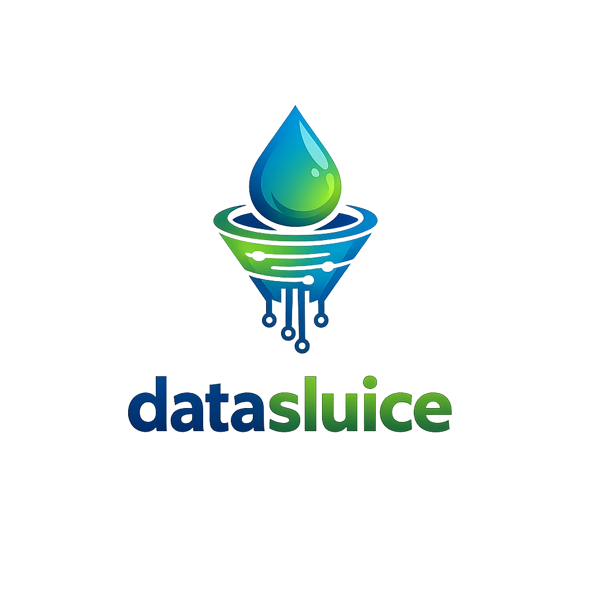

#  DataSluice

One Python interface for open-data discovery, extraction, format normalization, and pipeline integration.

## Getting started

- [Installation](install.md) — how to install DataSluice
- [Architecture](architecture.md) — how the library is structured
- [Adapters](adapters.md) — how portal adapters work
- [Supported Portals](supported-portals.md) — CKAN, data.gouv.fr, Socrata, and more
- [API Reference](api.md) — auto-generated API documentation

## Examples

- [CKAN](examples/ckan.md)
- [data.gouv.fr](examples/datagouv.md)
- [Socrata](examples/socrata.md)
- [pandas](examples/pandas.md)
- [dlt](examples/dlt.md)
- [Apache Airflow](examples/airflow.md)
